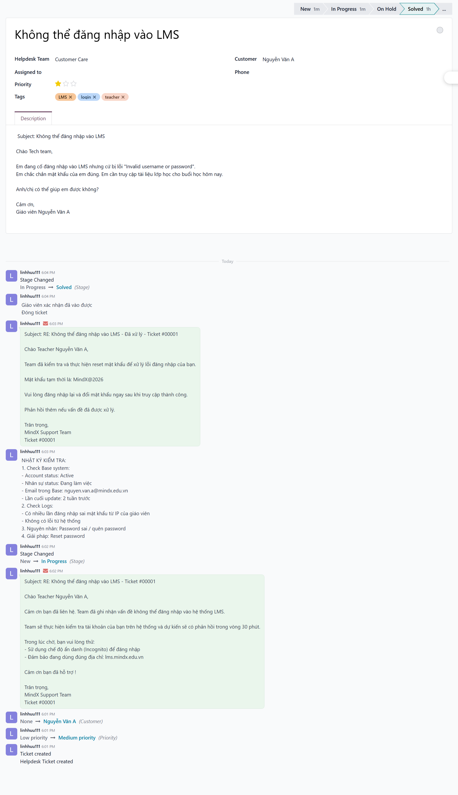
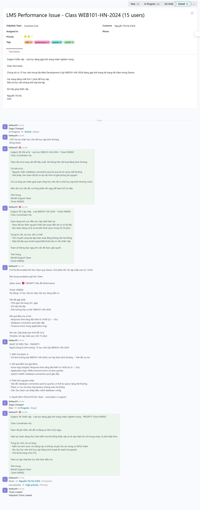
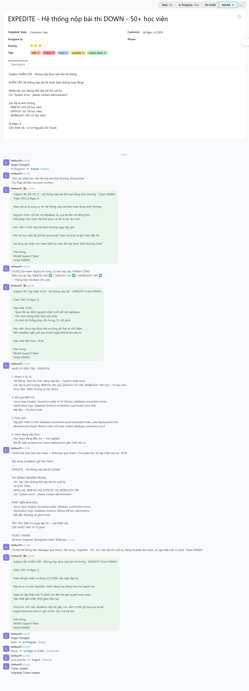
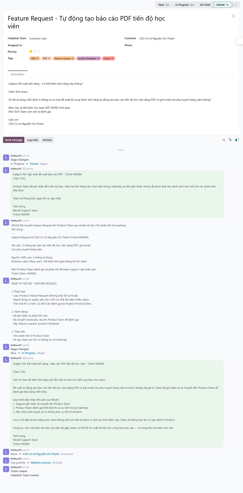
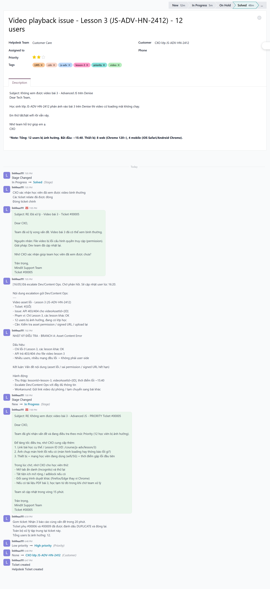
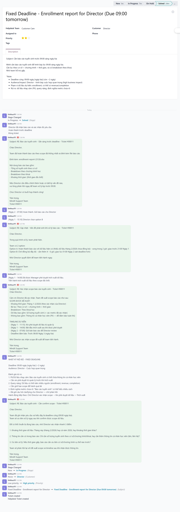

# 📄 Week 3 Report: Support Ticket Handling & Scenario Practice

This document summarizes the results of implementing 6 scenarios on the Odoo Helpdesk system during Week 3.

---

## 1. Overview

- **Objectives**: Practice the 7-step support process, Class of Service classification (Standard, Priority, Expedite, Fixed Deadline), and professional communication skills.
- **Results**: Completed 6/6 scenarios with full documentation on Odoo (Chatter logs).
- **Techniques Applied**: Differentiating between **Log notes** (internal/technical) and **Send messages** (client communication).

---

## 📸 2. Scenario Details (Screenshots)

### Scenario 1: Login Issue (Standard)
- **Ticket ID**: #00001
- **Evidence**: 

### Scenario 2: System Performance (Priority)
- **Ticket ID**: #00002
- **Evidence**: 

### Scenario 3: Critical Bug (Expedite)
- **Ticket ID**: #00003
- **Evidence**: 

### Scenario 4: Feature Request (Standard)
- **Ticket ID**: #00004
- **Evidence**: 

### Scenario 5: Video playback - Multi-user (Priority)
- **Ticket ID**: #00005
- **Evidence**: 

### Scenario 6: Urgent Report (Fixed Deadline)
- **Ticket ID**: #00011
- **Evidence**: 

---

