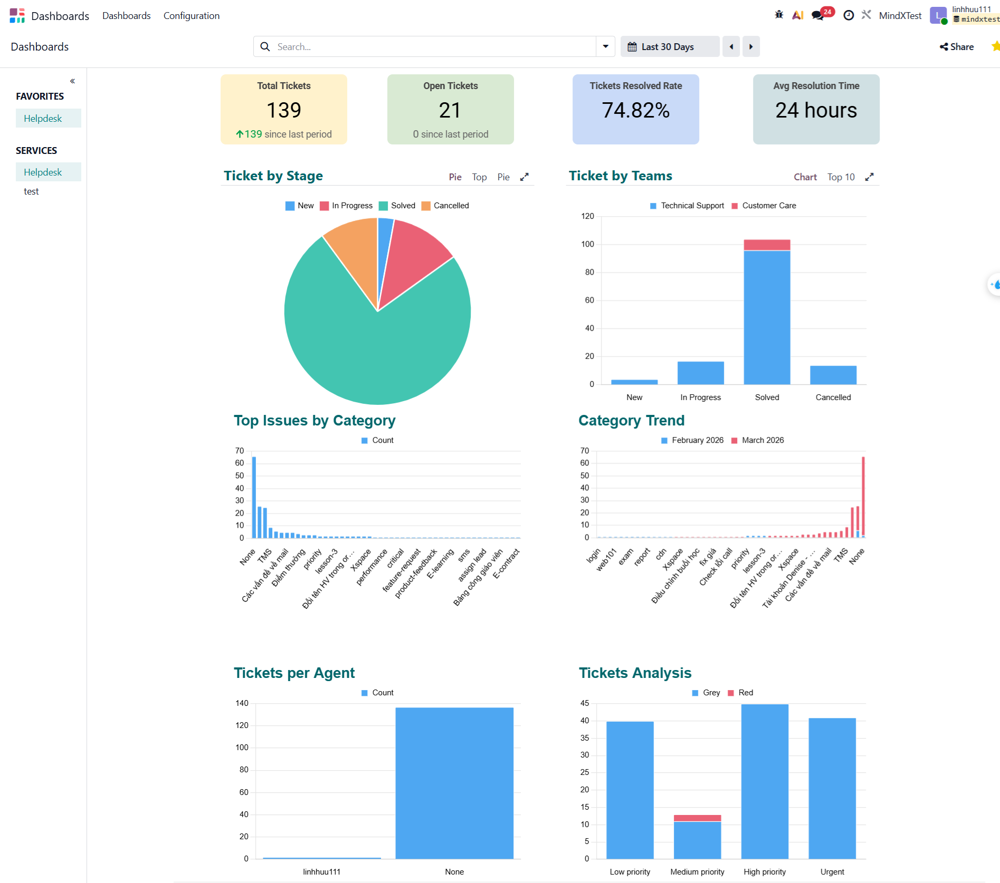
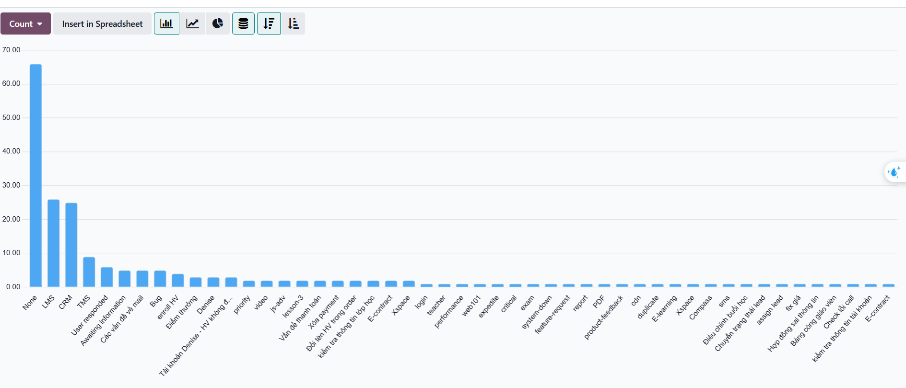

# Week 4: Helpdesk Performance & Dashboard Analysis

## 1. Overview
This report presents the consolidated performance metrics for Week 4, derived from the analysis of **139 helpdesk tickets** imported from `ticket_data.xlsx`. The primary focus is on identifying operational trends from this dataset and implementing data-driven improvements in Odoo to optimize future ticket handling.

---

## 2. Core KPI Metrics
Our dashboard indicates a robust resolution rate with a consistent average performance across the total volume.

Main KPI Dashboard - Overview of Status and Resolution Time

| Metric | Value | Status |
| :--- | :--- | :--- |
| **Total Tickets** | 139 | Bulk dataset analyzed |
| **Resolved Tickets** | 104 | 74.8% Resolution Rate |
| **Open Tickets** | 21 | Active backlog requiring triage |
| **Avg. Resolution Time** | 24 Hours | Baseline operational performance |

---

## 3. Advanced Dashboard Analytics
The Following visualizations from Odoo provide deeper insights into the ticket distribution and trends.

### Top Issues by Category

Distribution of tickets across various categories and tags.

### Category Trends

Historical trend analysis of ticket volume by category.

---

## 4. Recurring Ticket Patterns
The analysis of the 139 tickets reveals three significant operational patterns:

1.  **Critical Classification Gap**: 47.5% of the total dataset (66 out of 139 tickets) is tagged as 'None'. This represents a significant systemic failure in data classification, preventing granulated analysis of nearly half the helpdesk's workload.
2.  **Functional Support Concentration**: Identified issues are heavily concentrated in two modules: **LMS (26 tickets)** and **CRM (25 tickets)**. Combined, these represent the vast majority of categorized demand.
3.  **Ownership Assignment Gap**: Most tickets do not have a designated agent, with only a small number assigned to individuals (e.g., linhhuu111 handling 2 tickets).

---

## 5. Findings and Recommendations
The following findings are based on the statistical distribution across the 139-ticket dataset:

### Finding 1: Lack of Granular Visibility
*   **Data Evidence**: 66 tickets lack functional tags. This "None" category likely masks recurring technical bugs that could be addressed at the source if correctly identified.
*   **Recommendation**: Implement mandatory tagging at the "In Progress" stage in Odoo to eliminate the 'None' category for all future tickets.

### Finding 2: Primary Functional Demand in LMS/CRM
*   **Data Evidence**: LMS and CRM account for 37% of total volume and ~70% of classified volume.
*   **Recommendation**: Develop a specialized Knowledge base or "Quick Response" templates for LMS and CRM to reduce the resolution time for these frequent categories.

---

## 6. Action Plan for Volume Reduction
This plan focuses on improving data quality and resolution efficiency across the 139-ticket profile:

| Action Initiative | Specific Target | Expected Impact | Priority |
| :--- | :--- | :--- | :--- |
| **Mandatory Tagging Policy** | Classification Gap (66 'None') | 100% visibility for root cause analysis | High |
| **LMS/CRM SOP Update** | Functional Drivers (51 tickets) | 25% reduction in resolution time for core issues | High |
| **Legacy Data Audit** | 139 Ticket Cleanup | Reclassify the 66 'None' tickets to identify hidden bugs | Medium |
| **Dashboard Optimization** | Pipeline Transparency | Reduce the 21 open tickets to <10 by end of period | Medium |

---
