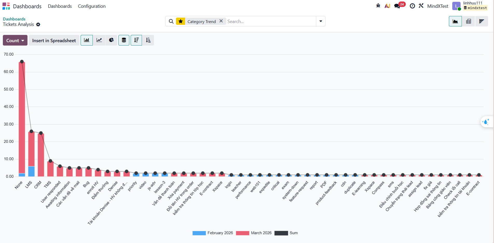

# Week 4: Reporting, Analysis & Problem Resolution

## 1. Overview
This report presents the consolidated performance metrics for Week 4, derived from the analysis of **141 helpdesk tickets** imported from `ticket_data.xlsx`. The primary focus is on identifying operational trends from this dataset and implementing data-driven improvements in Odoo to optimize future ticket handling.

---

## 2. Dashboard Metrics (KPIs)
Our dashboard indicates a robust resolution rate with a consistent average performance across the total volume.

Main KPI Dashboard - Overview of Status and Resolution Time

| Metric | Value | Status |
| :--- | :--- | :--- |
| **Total Tickets** | 141 | Bulk dataset analyzed |
| **Resolved Tickets** | 104 | 73.76% Resolution Rate |
| **Open Tickets** | 23 | Active backlog requiring triage |
| **Avg. Resolution Time** | 24 Hours | Baseline operational performance |

---

## 3. Advanced Dashboard Analytics

### Top 5 Issues by Category (Tags)

Based on actual tag distribution from Odoo:

| Rank | Tag | Tickets | % of 141 | Description |
| :--- | :--- | :--- | :--- | :--- |
| 1 | **LMS** | 26 | 18.4% | Enrollment, điểm thưởng, tài khoản Denise, lớp học |
| 2 | **CRM** | 25 | 17.7% | Lead/pipeline, chuyển CRM, gọi/SMS, payment |
| 3 | **TMS** | 9 | 6.4% | Chấm công, hiển thị lỗi, mất dữ liệu |
| 4 | **Các vấn đề về mail** | 5 | 3.5% | Cấp mail, reset mật khẩu mail Outlook |
| 5 | **Bug** | 5 | 3.5% | Lỗi hệ thống chung (Crystal, import lead) |

> **LMS + CRM** = 51/141 (36.2%) — These two tags account for the majority of the support workload.

> **None tag = 66 tickets (46.8%)** — Significant room for improvement in ticket tagging.

### Notable Sub-tags

| Tag | Tickets | Related To |
| :--- | :--- | :--- |
| enroll HV | 4 | LMS — lỗi enroll học viên vào lớp |
| Điểm thưởng | 3 | LMS — điểm cộng không cập nhật |
| Tài khoản Denise | 3 | LMS — HV không đăng nhập được |
| E-contract | 2 | CRM — hợp đồng hiển thị sai |
| Vấn đề thanh toán | 2 | CRM — không tạo QR, lỗi payment |

### Category Trends

---

## 4. Recurring Ticket Patterns

### 4.1. Pattern: Enrollment failures (LMS + CRM)

- **Frequency**: 6 LMS tickets + 5 CRM tickets = **11 tickets**
- **Symptom**: Business Units (BU) cannot enroll students → ticket created → Tech team opens slots manually.
- **Evidence**: #02865 "KHÔNG THỂ ENROLL HỌC VIÊN", #02855 "NHỜ TEAM TECH MỞ SLOT", #02849 "LỖI ENROLL", #02848 "ADD HỌC VIÊN VÀO LỚP TC-WEB93", #02934 "LỖI ENROLL HV VÀO LỚP HDT-JSB75"
- **Root Cause**: Class slots are full but UI does not display this clearly. No self-service request mechanism exists.

### 4.2. Pattern: Lead status not auto-updating (CRM)

- **Frequency**: **7 tickets**
- **Symptom**: BU adds payment → lead remains at L5A → ticket created to manually move to L6B.
- **Evidence**: #02871 "Chuyển trạng thái đóng tiền PH thành L6B", #02920 "Trạng thái lead", #02852 "Không đổi được trạng thái", #02854 "Hỗ trợ import lead trên CRM"
- **Root Cause**: Workflow automation "Lead Stage Update" not triggering upon payment confirmation.

### 4.3. Pattern: TMS Attendance errors at month-end

- **Frequency**: **5 tickets**
- **Symptom**: End of month → TMS does not display attendance data → BU cannot approve hours.
- **Evidence**: #02879 "TMS không hiển thị công cần duyệt", #02876 "LỖI TMS TỪ NGÀY 31", #02893 "tài khoản TMS không hiển thị công", #02935 "TMS lỗi không tạo bù công được"
- **Root Cause**: Date-range query logic fails to handle months with 31 days correctly.

### 4.4. Pattern: Reward Point Sync Issues (LMS)

- **Frequency**: **4 tickets**
- **Symptom**: Points added by BU → total doesn't change / ECount vs Denise data mismatch.
- **Evidence**: #02860 "BU cộng điểm nhưng điểm tổng không thay đổi", #02843 "SỐ LƯỢNG GIỮA ECOUNT VÀ DENISE KHÔNG THỐNG NHẤT", #02833 (same issue)
- **Root Cause**: Sync mechanism between ECount ↔ Denise is delayed or cache is not being invalidated.

### 4.5. Pattern: CRM Call/SMS non-functional

- **Frequency**: **3 tickets**
- **Symptom**: BU clicks Call or SMS in CRM → no response.
- **Evidence**: #02928 "CRM không bấm gọi được", #02868 "CRM không bấm gọi được", #02841 "CRM lại không gửi được tin nhắn"
- **Root Cause**: VoIP/SMS gateway credentials expired or rate-limited.

---

## 5. Findings & Recommendations

| # | Finding | Data Evidence | Recommendation |
| :--- | :--- | :--- | :--- |
| 1 | **Enrollment is the #1 issue** across LMS and CRM | 11 enrollment tickets (7.8% of total) | Implement self-service enrollment + clearer UI notifications |
| 2 | **Lead automation is incomplete** | 7 manual stage update tickets | Fix workflow trigger upon payment confirmation |
| 3 | **TMS has recurring bug on day 31** | 5 tickets concentrated on the 31st | Fix date-range logic + add unit tests for edge cases |
| 4 | **46.8% of tickets lack tags** | 66/141 tickets marked "None" | Set Tag as a required field + create tagging guide for BU |
| 5 | **Reward point sync failure** | 4 tickets (ECount ≠ Denise) | Fix sync API + implement daily reconciliation report |

---

## 6. Action Plan

### 6.1. [LMS/CRM] Enrollment — 11 tickets

| | |
| :--- | :--- |
| **Problem** | BU cannot enroll when slots are full, requiring a ticket (#02865, #02855, #02849) |
| **Action** | 1. Add "Slot Full" notification to UI 2. Create slot request form (replacing tickets) 3. Grant Managers permission to adjust slots |
| **Owner** | LMS Product Team |
| **Target Metric** | 11 → ≤ 2 tickets/week |
| **Measurement** | Filter tag "enroll HV" + keyword "enroll" in Odoo reports |
| **Timeline** | 2 weeks |

### 6.2. [CRM] Lead/Pipeline — 7 tickets

| | |
| :--- | :--- |
| **Problem** | Lead remains in stage L5A after payment confirmation (#02871, #02920, #02852) |
| **Action** | 1. Create automation: payment confirmed → move lead to L6B 2. Test with 5 leads 3. Monitor for 1 week |
| **Owner** | CRM Backend Engineer |
| **Target Metric** | 7 → 0 tickets/week |
| **Measurement** | Filter tag "CRM" + keyword "trạng thái" or "lead" |
| **Timeline** | 1 week |

### 6.3. [TMS] Attendance — 5 tickets

| | |
| :--- | :--- |
| **Problem** | TMS fails to display data for months with 31 days (#02879, #02876, #02935) |
| **Action** | 1. Fix date-range query (use dynamic last day) 2. Review check-in logic 3. Implement unit tests for day 31 |
| **Owner** | TMS Dev Team |
| **Target Metric** | 0 attendance tickets at month-end |
| **Measurement** | Filter tag "TMS" + keyword "chấm công" at end of month |
| **Timeline** | 1 week |

### 6.4. [LMS] Reward Points — 4 tickets

| | |
| :--- | :--- |
| **Problem** | Points not updating, mismatch between ECount ↔ Denise (#02860, #02843) |
| **Action** | 1. Fix sync API ECount ↔ Denise 2. Fix cache invalidation 3. Set up daily reconciliation report |
| **Owner** | LMS Backend Team |
| **Target Metric** | 0 "points not changing" tickets |
| **Measurement** | Filter tag "Điểm thưởng" |
| **Timeline** | 2 weeks |

### 6.5. [CRM] Call/SMS — 3 tickets

| | |
| :--- | :--- |
| **Problem** | CRM calling/SMS functionality fails (#02928, #02841) |
| **Action** | 1. Renew VoIP/SMS credentials 2. Automated health check every 1h 3. Alert when uptime < 99% |
| **Owner** | CRM Integration Team |
| **Target Metric** | Uptime ≥ 99.5% |
| **Measurement** | Health check dashboard |
| **Timeline** | 1 week |

### 6.6. [General] Untagged Tickets — 66 tickets

| | |
| :--- | :--- |
| **Problem** | 46.8% tickets have no tag, hindering analysis (#02891 "hỗ trợ enroll", #02630 "Lỗi TMS I4081") |
| **Action** | 1. Set tag as "Required" in Odoo form 2. Create tagging guide for BU 3. Reclassify the 66 existing tickets |
| **Owner** | Odoo Admin + Support Lead |
| **Target Metric** | 0% "None" tickets |
| **Measurement** | Odoo report → filter tag = None |
| **Timeline** | Immediate |

---
